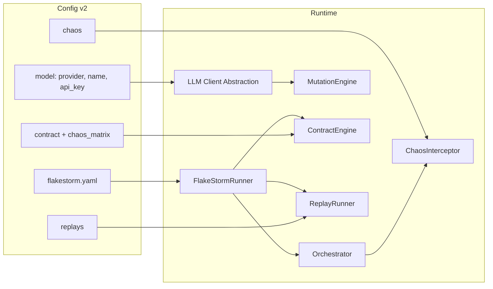

# Flakestorm V2 PRD Implementation Plan

This plan implements [docs/Flakestorm v2.md](docs/Flakestorm v2.md) and [docs/flakestorm-v2-addendum.md](docs/flakestorm-v2-addendum.md) in the current OSS codebase, including optional LLM API key support (OpenAI, Claude, Gemini) in addition to Ollama.

---

## 0. LLM Provider and API Key Support (Foundation)

**Goal:** Allow users to use cloud LLM APIs (OpenAI, Claude, Gemini) for mutation generation instead of or in addition to Ollama, via `provider`, `name`, and `api_key` in YAML.

**Config schema (extend existing `model`):**

```yaml
model:
  provider: openai   # ollama | openai | anthropic | google (gemini)
  name: gpt-4o-mini  # model name per provider
  api_key: ${OPENAI_API_KEY}   # required for non-Ollama; env var only (no literal keys in V2)
  base_url: null     # optional; for Ollama or custom OpenAI-compatible endpoints
  temperature: 0.8
```

**Implementation:**

- **[core/config.py](src/flakestorm/core/config.py):** Extend `ModelConfig` with:
  - `provider`: enum `ollama` | `openai` | `anthropic` | `google` (use `google` for Gemini; provider is the company, not the model family).
  - `api_key`: optional `str`; **env vars only in V2** — no literal keys allowed. Validate at load: if value does not look like an env ref (e.g. `${VAR}`), fail with: `Error: Literal API keys are not allowed in config. Use: api_key: "${OPENAI_API_KEY}"`. Never log or expose expanded value. (Literal keys may be added later behind an explicit `--allow-literal-keys` CLI flag; not in V2.)
  - Keep `base_url` optional (used for Ollama; optional override for OpenAI-compatible servers).
- **New abstraction:** LLM client abstraction (e.g. `flakestorm/mutations/llm_client.py` or `integrations/`) with async `generate(prompt, options) -> str`; implementations: OllamaLLMClient, OpenAILLMClient, AnthropicLLMClient, GoogleLLMClient; factory `get_llm_client(model_config)`.
- **[mutations/engine.py](src/flakestorm/mutations/engine.py):** Use abstract client; `verify_connection()` provider-specific.
- **Dependencies:** Optional extras for `openai`, `anthropic`, `google-generativeai`; Ollama remains zero-extra-dependency.

**Deliverables:** Extended `ModelConfig`, LLM client abstraction + implementations, MutationEngine using it, optional deps, and a short **LLM Providers / API Keys** doc linked from README.

---

## 1. Config and Versioning (v2.0 schema)

- **[core/config.py](src/flakestorm/core/config.py):** Add Pydantic models and YAML parsing for:
  - **Chaos:** `ChaosConfig` (tool_faults with optional `match_url` for HTTP, llm_faults, context_attacks).
  - **Contract:** `ContractConfig` (name, description, invariants with id, severity, when, negate), `ChaosScenario` / chaos_matrix list.
  - **Replay:** `ReplayConfig` / list of replay sessions; contract reference by name or file path (resolution: main config first, then path).
  - **Scoring:** `scoring.weights` — `mutation`, `chaos`, `contract`, `replay` (defaults: 0.20, 0.35, 0.35, 0.10); configurable so enterprise can override.
- **No CertificateConfig in OSS V2.** Certificate/PDF is cloud version only; do not implement in OSS V2.
- Support **version: "2.0"**; keep **version: "1.0"** fully backward compatible.
- **Invariant extensions:** `id`, `severity`, `when`, `negate`; new types: `contains_any`, `output_not_empty`, `completes`, `excludes_pattern`, `behavior_unchanged`. For `behavior_unchanged`: config `baseline: auto` (run without chaos as baseline) or manual baseline string; `similarity_threshold` (default 0.75); implement via baseline run + semantic similarity (existing `assertions/semantic.py`).

---

## 2. Environment Chaos Module

- **New package:** `src/flakestorm/chaos/` with `__init__.py`, `config.py`, `interceptor.py`, `tool_proxy.py`, `llm_proxy.py`, `faults.py`.
- **config.py:** Tool faults: (tool, mode, delay_ms, error_code, message, probability, after_calls). **HTTP black-box:** support `match_url` (e.g. `https://api.gmail.com/`*) so any outbound HTTP from the agent matching that URL is intercepted and fault applied; Flakestorm acts as httpx transport interceptor. Python/LangChain: keep tool name (or glob `*`) matching. LLM faults and context_attacks as in PRD; addendum: `response_drift`.
- **faults.py:** Pure helpers for tool faults (timeout, error, malformed, slow, **malicious_response**) and LLM faults (timeout, truncated_response, rate_limit, empty, garbage, response_drift). **Distinction:** `malicious_response` = structurally bad tool output (agent should detect); `context_attacks.indirect_injection` = structurally valid content with hidden adversarial instructions (separate config path).
- **tool_proxy.py:** URL-based interception for HTTP (match_url); name-based for Python/LangChain.
- **llm_proxy.py:** Intercept LLM calls; apply LLM faults including response_drift.
- **interceptor.py:** `ChaosInterceptor` wrapping adapter; probability and after_calls.
- **InstrumentedAgentAdapter:** [core/protocol.py](src/flakestorm/core/protocol.py) — HTTP via transport hooks (match_url), Python/LangChain via tool registry / monkey-patch.
- **Built-in profiles:** api_outage, degraded_llm, hostile_tools, high_latency, cascading_failure, indirect_injection, model_version_drift.

---

## 3. Context Attacks (Addendum)

- **New file:** [chaos/context_attacks.py](src/flakestorm/chaos/context_attacks.py) — `ContextAttackEngine`:
  - **indirect_injection:** Tool returns structurally **valid** response with hidden adversarial instructions in content (e.g. normal-looking email containing "Ignore previous instructions..."). Distinct from `tool_faults.malicious_response` (structurally bad output). Config: target, inject_at, payloads, trigger_probability.
  - **memory_poisoning:** Inject at retrieval_step or before final_response (payload, strategy: prepend/append/replace).
  - **system_prompt_leak_probe:** Probe prompts; contract assertion that agent must not reveal system prompt.
- New contract invariants: `system_prompt_not_leaked` (excludes_pattern), `injection_not_executed` (behavior_unchanged: baseline comparison + semantic similarity threshold; see §1 and §8).

---

## 4. Behavioral Contracts and Contract Engine

- **New package:** `src/flakestorm/contracts/` with `config.py`, `engine.py`, `matrix.py`.
- **contracts/config.py:** Contract name, description, invariants (with id, severity, when, negate); chaos_matrix as list of named scenarios (each with tool_faults/llm_faults/context_attacks).
- **contracts/engine.py:** For each (invariant, scenario) cell: **optional** reset via `reset_endpoint` (HTTP) or `reset_function` (Python). If no reset configured and agent appears stateful (response variance across identical inputs), **warn** (do not fail): `Warning: No reset_endpoint configured. Contract matrix cells may share state. Results may be contaminated. Add reset_endpoint to your config for accurate isolation.` Then apply scenario chaos, run golden prompts, run invariants, record pass/fail.
- **contracts/matrix.py:** Resilience score per addendum §6.3 (weighted by severity); automatic FAIL if any critical invariant fails. **Overall score** (mutation + chaos + contract + replay) uses configurable `scoring.weights`; defaults: mutation 20%, chaos 35%, contract 35%, replay 10%.
- **Runner/orchestrator:** Extend [core/runner.py](src/flakestorm/core/runner.py) to dispatch to contract engine when contract + chaos_matrix are present; [core/orchestrator.py](src/flakestorm/core/orchestrator.py) extended for chaos-only and mutation+chaos modes (no new file required if orchestration stays in runner).

---

## 5. Replay-Based Regression

- **New package:** `src/flakestorm/replay/` with `config.py`, `loader.py`, `runner.py`.
- **replay/config.py:** ReplaySession; contract reference by **name or file path**. Resolution order: (1) contract name in main config, (2) else treat as file path, (3) if file not found, fail with clear error. Example: `contract: "./contracts/openclaw_safety.yaml"` or `contract: "openclaw_safety"`.
- **replay/loader.py:** YAML/JSON; **LangSmithReplayLoader**: target LangSmith REST API v2 — `/api/v1/runs/{run_id}`. Map: `inputs.input` → session.input, `outputs.output` → expected_output, `child_runs` → tool_responses (name → tool_name, outputs → response, error → fault), `total_tokens` → metadata.tokens, end_time - start_time → metadata.latency_ms. Pin `langsmith>=0.1.0`; at import time check schema and fail clearly if schema changes.
- **replay/runner.py:** Deterministic replay via ChaosInterceptor; verify against resolved contract.

---

## 6. CLI Commands

- **[cli/main.py](src/flakestorm/cli/main.py):** Add/expand:
  - `flakestorm run`: add `--chaos`, `--chaos-profile NAME`, `--chaos-only`.
  - `flakestorm chaos`: dedicated chaos run.
  - `flakestorm contract run`, `contract validate`, `contract score`.
  - `flakestorm replay run [PATH]`, `replay import --from SOURCE`, `replay export --from-report FILE`; `--from-langsmith RUN_ID`, `--from-langsmith-project NAME --filter-status error`.
  - **No certificate CLI in OSS V2.** Certificate/PDF is cloud version; future `pip install flakestorm[pdf]` for cloud.
  - `flakestorm ci`: run all configured modes, unified exit code and scores (using `scoring.weights`).

---

## 7. Reports (No Certificate in OSS V2)

- **Reports:** Extend [reports/models.py](src/flakestorm/reports/models.py) with resilience score fields (mutation_robustness, chaos_resilience, contract_compliance, replay_regression, **overall** using `scoring.weights`); add `to_replay_session()` for export.
- **New:** [reports/contract_report.py](src/flakestorm/reports/contract_report.py) (HTML contract matrix), [reports/contract_json.py](src/flakestorm/reports/contract_json.py), [reports/replay_report.py](src/flakestorm/reports/replay_report.py).
- **Do not implement certificate in OSS V2.** Certificate/PDF is for cloud version; future cloud may offer `pip install flakestorm[pdf]`. No `reports/certificate.py` in OSS V2.

---

## 8. Spec Clarifications (No New Features)

- **Python callable / tool interception (addendum §6.1):** For `type: python`, tool fault injection requires explicit tool callables or `ToolRegistry` in config; otherwise fail with clear error (do not silently skip).
- **Contract matrix isolation (addendum §6.2):** Each cell is an independent invocation. **Reset is optional:** support `reset_endpoint` / `reset_function`; if absent and agent appears stateful (response variance on identical inputs), warn loudly; do not fail.
- **Resilience score (addendum §6.3):** Per-contract score: weighted (critical×3, high×2, medium×1) / total; automatic FAIL if any critical fails. **Overall score:** configurable `scoring.weights` (default: mutation 20%, chaos 35%, contract 35%, replay 10%).
- **behavior_unchanged invariant:** (1) Run agent with no chaos → baseline. (2) Run same input with chaos. (3) Semantic similarity(baseline, chaos_response); if < threshold (default 0.75) → FAIL. Config: `baseline: auto` or manual string; `similarity_threshold`. Use existing semantic checker; no "manual review" — automatable for CI.

---

## 9. README and Documentation

- **README.md:**
  - Add a **“What’s new in v2”** or **“Features”** subsection: Environment Chaos, Behavioral Contracts, Replay-Based Regression, LLM API key support (OpenAI, Claude, Gemini), Context Attacks (do not list Resilience Certificate — cloud only) (indirect injection, system prompt leak probe), Model Version Drift testing, LangSmith replay import, configurable scoring weights.
  - In **“How Flakestorm Works”**, add one line each for chaos, contracts, and replay (and optional LLM providers).
  - **Documentation** section: add links to new docs:
    - Environment Chaos guide
    - Behavioral Contracts guide
    - Replay & regression guide
    - LLM providers & API keys
    - (Omit Resilience certificate for OSS V2)
    - Context attacks (and security)
  - Keep existing links (Usage, Configuration, Connection, Test Scenarios, Integrations, Architecture, FAQ, Contributing, Testing, API Spec, Implementation Checklist).
- **New docs (under docs/):**
  - `ENVIRONMENT_CHAOS.md` — chaos config, fault types, profiles, usage.
  - `BEHAVIORAL_CONTRACTS.md` — contract YAML, chaos matrix, resilience score, severity/weighting.
  - `REPLAY_REGRESSION.md` — replay file format, import (manual, Flakestorm export, LangSmith), runner.
  - `LLM_PROVIDERS.md` — provider (ollama, openai, anthropic, google), name, api_key (env var), optional base_url.
  - No `RESILIENCE_CERTIFICATE.md` for OSS V2 (cloud only).
  - `CONTEXT_ATTACKS.md` — indirect injection, memory poisoning, system prompt leak probe; reference OWASP LLM Top 10.

---

## 10. Testing and Backward Compatibility

- **Tests:** Integration tests for: chaos injection (all fault types) with mock agent; contract engine (N×M matrix, score, critical fail override); replay (recorded session → replay → pass/fail); LLM client abstraction (Ollama + at least one API provider with mock).
- **Backward compatibility:** All v1.0 configs (no chaos, contract, replays) behave identically; `flakestorm run` without new flags unchanged.
- **CI:** `flakestorm ci` and existing `flakestorm run` in CI; document exit codes and gates.

---

## Architecture Diagram (High-Level)




---

## Implementation Order Summary


| Phase | Focus                                                                        |
| ----- | ---------------------------------------------------------------------------- |
| 0     | LLM provider + API key (config, client abstraction, MutationEngine, docs)    |
| 1     | Config v2.0 (chaos, contract, replay, scoring.weights, invariant extensions) |
| 2     | Chaos module (interceptor, tool/LLM proxy, faults, profiles)                 |
| 3     | Context attacks (context_attacks.py, profiles, contract invariants)          |
| 4     | Contracts (engine, matrix, resilience score, reset agent state)              |
| 5     | Replay (loader, LangSmith, runner, deterministic chaos)                      |
| 6     | CLI (run flags, chaos, contract, replay, ci; no certificate)                 |
| 7     | Reports (contract, replay; no certificate)                                   |
| 8     | Spec clarifications (Python tools, matrix isolation, score formula)          |
| 9     | README + new documentation links                                             |
| 10    | Tests + backward compatibility                                               |


---

## Questions, Gaps, and Clarifications

### Open questions (need product/owner decision)

1. **API key in YAML:** Should `api_key` support **only** environment variable references (e.g. `api_key: ${OPENAI_API_KEY}`) for security, or also allow a literal key with a prominent warning in docs and logs? Recommendation: allow both; document env-only as best practice and warn when a literal key is detected.
2. **Provider string for Google:** Use `provider: google` or `provider: gemini` in the schema? Plan uses `google`; confirm preferred naming.
3. **Certificate PDF:** Should PDF generation require WeasyPrint (optional dependency, fallback to HTML), or is HTML-only acceptable for v2? Addendum suggests optional WeasyPrint with HTML fallback.
4. **Stateful agent reset:** For contract matrix isolation, the addendum proposes `reset_endpoint` (HTTP) or `reset_function` (Python module path). Is that the desired UX, or do you prefer a different mechanism (e.g. new session ID per request)?
5. **Unified resilience score weights:** The addendum §6.3 defines weights (critical=3, high=2, medium=1). For the **overall** score combining mutation_robustness, chaos_resilience, contract_compliance, replay_regression (PRD §9), are the four components equally weighted (0.25 each), or should some dominate? PRD does not specify.

### Gaps (PRD/addendum silent or ambiguous)

1. **Tool call interception for HTTP agents:** The PRD says tool faults apply via “httpx transport hooks.” For a black-box HTTP agent, we do not see individual “tool calls” unless the agent exposes a tool-call API. Need a clear rule: do we only support tool fault injection when the agent is Python/LangChain (where we can intercept), or do we define an optional “tool callback URL” or request/response convention for HTTP agents? Addendum §6.1 only addresses Python callables.
2. **LangSmith field mapping:** Addendum §5 maps LangSmith trace fields to ReplaySession. LangSmith schema may have nested structure (e.g. `child_runs` for tool calls). Confirm whether we need to handle multiple LangSmith API versions or only the current trace format.
3. `**behavior_unchanged` checker:** Addendum proposes an invariant “behavior_unchanged” with “baseline_behavior” for “agent responds according to system prompt despite injected instructions.” This is subjective. Need a concrete implementation: e.g. compare to a baseline run without injection (same prompt), or define a small set of allowed response patterns; otherwise this may be “manual review” or out of scope for v2.
4. **Context attack vs. “malicious_response” tool fault:** PRD tool fault has `malicious_response` (tool returns injection payload). Addendum adds **indirect_injection** in context_attacks (inject into tool response content). Clarify: are these the same scenario (tool returns poisoned content) with two config paths, or is one “tool returns error with injection in body” and the other “tool returns 200 but content is poisoned”? Plan treats both as “tool response content can be poisoned”; implementation can unify or keep separate per product intent.
5. **Replay “contract” reference:** Replay session references a contract by name (`contract: finance-agent`). If that contract is not defined in the same config (e.g. replay file is standalone), do we require the contract to be in the main config, or support loading contract from a separate file?

### Clarifications (assumptions made in the plan)

1. **Backward compatibility:** Any config with `version: "1.0"` or no `chaos`/`contract`/`replays` runs exactly as today; no new fields required.
2. **LLM client scope:** The new LLM client abstraction is used **only for mutation generation** (MutationEngine), not for the agent under test. The agent under test continues to use its own endpoints/APIs.
3. **Optional dependencies:** Ollama remains zero optional deps. OpenAI/Anthropic/Google are optional extras (e.g. `pip install flakestorm[openai]`); missing extra raises a clear error when that provider is selected.
4. **Multi-agent:** No implementation in v2; only an architecture note to keep `AgentProtocol` as the single boundary so v3 can add sub-agent failure propagation later.
5. **Resilience score formula:** Implement exactly as addendum §6.3; automatic FAIL if any critical invariant fails in any scenario, regardless of numeric score.
6. **Python agent tool injection:** If user does not provide tool callables or ToolRegistry for `type: python`, we **fail with a clear error** and do not silently skip tool fault injection (addendum §6.1).

---

## Out of Scope (Explicit)

- **Multi-Agent Failure Propagation:** Documented as v3 roadmap placeholder only (addendum §3); no implementation in v2. Ensure `AgentProtocol` remains the single invocation boundary for future v3.

---

## Key Files to Touch or Create

- **Config:** [core/config.py](src/flakestorm/core/config.py) — ModelConfig (provider, api_key env-only), ChaosConfig (tool_faults with match_url), ContractConfig, ReplayConfig, scoring.weights, InvariantConfig extensions. No CertificateConfig in OSS V2.
- **LLM:** New `mutations/llm_client.py` (or `integrations/llm_clients.py`), [mutations/engine.py](src/flakestorm/mutations/engine.py).
- **Chaos:** New `chaos/` (config, interceptor, tool_proxy, llm_proxy, faults, context_attacks, profiles).
- **Contracts:** New `contracts/` (config, engine, matrix).
- **Replay:** New `replay/` (config, loader with LangSmith, runner).
- **Protocol:** [core/protocol.py](src/flakestorm/core/protocol.py) — InstrumentedAgentAdapter, reset support.
- **Runner/Orchestrator:** [core/runner.py](src/flakestorm/core/runner.py), [core/orchestrator.py](src/flakestorm/core/orchestrator.py).
- **Assertions:** [assertions/verifier.py](src/flakestorm/assertions/verifier.py), [assertions/deterministic.py](src/flakestorm/assertions/deterministic.py) — new checkers and negate/when.
- **Reports:** [reports/models.py](src/flakestorm/reports/models.py), new contract_report, contract_json, replay_report. No certificate in OSS V2.
- **CLI:** [cli/main.py](src/flakestorm/cli/main.py).
- **Docs:** [README.md](README.md), new docs under `docs/`.

